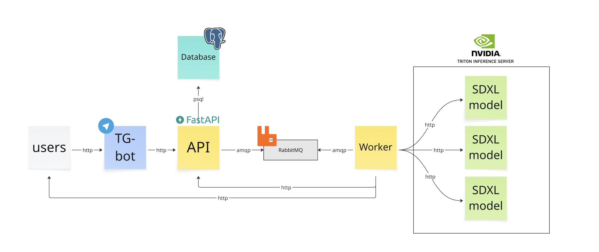

## Artifex AI — Service for Branded Image Generation

At Artifex-AI, we help designers and brand managers quickly create visuals that comply with brand guidelines. We use AI to enhance text descriptions and generate branded images, accelerating workflows, saving resources, and ensuring visual consistency.

### System Architecture


### Project Structure

```
.
├── README.md
├── api/                  # FastAPI service (registration, task management)
├── content-generator/    # Image generation module (interacts with Triton)
├── worker/               # Asynchronous task processor from the queue
├── tg-bot/               # Telegram bot for user interaction
├── research/             # Model research and testing
├── product-research/     # Business analytics and research

```

### Features
- User registration and task creation via `Telegram`
- Asynchronous task queue using `RabbitMQ`
- Image inference via `Triton Inference Server`
- Scalable architecture for production workloads

❗ Important MVP limitation: At this stage, saving generated images to S3 is not implemented. Images are only available during the Telegram session and are not stored externally.
This limitation will be addressed in the next development iteration.

### Documentation
Detailed documentation including environment variables for each service:

- [Product research](product-research/README.md)
- [AI models research](research/README.md)
- [TG-Bot](tg-bot/README.md)
- [API](api/README.md)
- [Worker](worker/README.md)
- [Triton inference Models](content-generator/README.md)

### Running with Docker Compose
❗Note: An active VPN connection to the private network hosting the Triton Inference Server is required.

```bash
docker-compose up --build -d
```

### Usage
- Telegram bot: @AIArtifexBot
- [Watch demo video](https://disk.yandex.ru/i/psWPYnWrA_ycfw)
