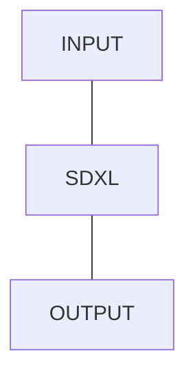

## Content-generator

Выполняет препроцессинг промпта, добавляя корпоративные цвета и тег для `LoRA` адаптера.
Генерирует корпоративный контент по обогащенному промпту.

Инференс осуществляется в **Triton Inference Server**. Для деплоя используется фреймворк собственной (командной) разработки `triton-toolkit`.

❗ Важно: Для работы требуется активное VPN-соединение с закрытым контуром, где развернут `Triton Inference Server`.


### Минимальные требования
* Python 3.10

### Установка

1. Установите все зависимости с помощью **poetry** (1.6.1):

```commandline
poetry install
```

Если **poetry** не установлен, установите его на уровне системы или
в текущем виртуальном окружении:

```bash
pip install poetry==1.6.1
```

2. Добавьте **src** в `PYTHONPATH`.

Обычно, это может делать IDE. Но если нет возможности использовать IDE для этого, то можно
либо экспортировать ее в текущем терминале:

```bash
export PYTHONPATH=src
```

Либо использовать `PYTHONPATH=src` перед каждой python командой.

### Деплой

1. Создайте `.env` файл в **корне** проекта и установите в нем следующие переменные окружения

Конфигурация **Triton** репозитория моделей:
   * `TRITON_REPOSITORY_URL` - **URL** S3 репозитория, который используется **Triton Inference Server** для загрузки моделей
   * `TRITON_REPOSITORY_ACCESS_KEY_ID` - **Access key id** (username) для авторизации
   * `TRITON_REPOSITORY_SECRET_ACCESS_KEY` - **Secret access key** (password) для авторизации
> Указанные данные для авторизации должны предоставлять **RW** доступ (чтение и запись)
   * `TRITON_REPOSITORY_BUCKET` - **Bucket**, в котором хранится репозиторий моделей
   * `TRITON_REPOSITORY_PREFIX` - Путь до **корня** (базовой директории) репозитория моделей
> При хранении моделей в корне **bucket**'a `TRITON_REPOSITORY_PREFIX` должен быть пустой строкой

Конфигурация репозитория исходных файлов (веса моделей и т.п.):
   * `SOURCE_REPOSITORY_URL` - URL S3 репозитория, в котором хранятся исходные файлы
   * `SOURCE_REPOSITORY_ACCESS_KEY_ID` - **Access key id** (username) для авторизации
   * `SOURCE_REPOSITORY_SECRET_ACCESS_KEY` - **Secret access key** (password) для авторизации
> Указанные данные для авторизации должны предоставлять **RO/RW** доступ (чтение)
   * `SOURCE_REPOSITORY_BUCKET` - **Bucket**, в котором хранятся исходные файлы
   * `SOURCE_REPOSITORY_PREFIX` - Путь до **директории**, в которой хранятся исходные файлы
> При хранении исходных файлов в корне **bucket**'a `SOURCE_REPOSITORY_PREFIX` должен быть пустой строкой


2. Запустите скрипт деплоя
```commandline
python src/deployment.py
```

## Тестирование

Для тестирования необходимо установить переменную `TRITON_CLIENT_URL` в ранее созданном `.env` файле.

В качестве значения для переменной необходимо указать **полный URL** (включая схему)
**Triton Inference Server**'a, на который будет отправлен запрос.

### Ручное

Для ручного тестирования необходимо запустить скрипт инференса:

```commandline
python src/client.py --help
```

В случае успешного инференса сгенерированное изображение будет открыто в новом окне средствами операционной системы с помощью `Image.show()`.

### Нагрузочное

Для запуска нагрузочного тестирования необходимо:

1. Установить переменную `TRITON_CLIENT_URL` в ранее созданном `.env` файле
в значение, соответствующее тестируемому окружению (см. [Инференс](#Инференс)).
2. Запустить [locust](https://locust.io):

```commandline
locust -f tests/load/main.py TritonUser
```

3. Перейти по ссылке в Web UI - http://localhost:8089
4. Настроить требуемые параметры и запустить тестирование

### Инференс

Инференс осуществляется путем отправки **HTTP** запроса на **Triton Inference Server** в требуемом окружении:

#### Запрос

Метод: **POST**
Путь: **/v2/models/artifex-ai.main/infer**

**Запрос** может быть отправлен в виде `application/json` или в виде `application/octet-stream`.

Тело **запроса** для `application/json` должно иметь следующий формат:
```json
{
          "inputs": [
            {
              "name": "prompt",
              "shape": [1],
              "datatype": "BYTES",
              "data": ['prompt']
            }
          ]
}
```

Вместо `<prompt>` необходимо подставить промпт для генерации изображения.

### Архитектура
В основе модели лежит [SD-XL 1.0-base](https://huggingface.co/stabilityai/stable-diffusion-xl-base-1.0)
с открытым кодом. Также используется 1 адаптер `LoRA` для генерации изображений в конкретном стиле (дообучение производилось в [исследовании](https://www.kaggle.com/code/hyperglitch/pipeline-improvement)).

Реализация сети в **Triton Inference Server** состоит из основной main **python** модели, реализованной на python backend'е.


